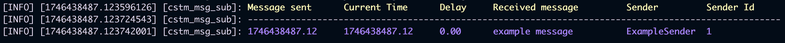

<p align = "center">
    
</p>

<div align = "center">
    <h1>ROS 2</h1>
</div>

<div align = "center">
    <p>A minimal ROS 2 Workspace that helps us to sent custom type messages</p>
</div>

<div align = "center">


</div>

## About
This project is about a building custom message type in ROS 2-based development environment. The custom message includes message, name, and Id of the user; furthermore, timestamp of the message (when it is sent) is also stored in the custom message type.

## How to Build
First make sure you have properly configured colcon in your terminal.
Then follow the steps to build.

Step 1: Source the ROS 2 environment:
```bash
source /opt/ros/humble/setup.bash
```

Step 2: Navigate to the directory:
```bash
cd ros2_ws
```

Step 3: Build:
```bash
colcon build
``` 

Step 4: Source the Workspace:
```bash
source install/setup.bash
``` 

## How to Run
Open **two separate terminals** and make sure ROS 2 properly sourced in both

In the **first** terminal run:
```bash
ros2 run text_publisher cstm_msg_pub
```

In the **second** terminal run:
```bash
ros2 run text_subscriber cstm_msg_sub
```

## Example
After successfully building the workspace and runing both packages, you may now enter your custom message.

In the terminal where the **publisher** package is running, you will see:
```bash
[INFO] [1746438260.960731549] [txt_publisher]: You may now enter your custom message
Enter the message:
Enter sender name:
```

Go ahead and enter your message and your name
```bash
Enter the message: example message
Enter sender name: ExampleSender
```

And now if you check the terminal where the **subsciber** package is running, you will see:


To stop packages use Ctrl+C

## Reflections and Challenges Encountered
Throughout this project, I learned how to build a ROS 2 Workspace while implement custom message types in ROS 2 WS. Additionally, this project helped me get the idea of how to write a clean code for ROS 2 by separating logic into different nodes and organazing them inside various packages. To implement ROS 2 properly in my macOS system, I used a Docker container to run Ubuntu, since as I learned some ROS 2 packages don’t work properly for Macs. Moreover, using the link provided in TASK.md (https://docs.ros.org/en/humble/Tutorials/Beginner-Client-Libraries/Custom-ROS2-Interfaces.html#create-a-new-package) I learned how to create custom message types and use it across different packages.

When it comes to the challenges I encountered during the project, time management was one of key difficulties, considering that the exam period was approaching while I was working on this project. For this exact reason, I didn't manage to implement some of the optional extensions. However, challenges regarding the project didn’t quite struggle me, even though one of the link I have been provided with in TASK.md didn’t really work. Instead, I used online documentations such as https://docs.ros.org/en/humble/Tutorials/Beginner-Client-Libraries/ and some video tutorials to learn how to build ROS 2 WS and run ROS 2 nodes. Furthermore, online documentation and videos helped me to learn how to properly modify .xml and setup.py files if the project is meant to be published. 